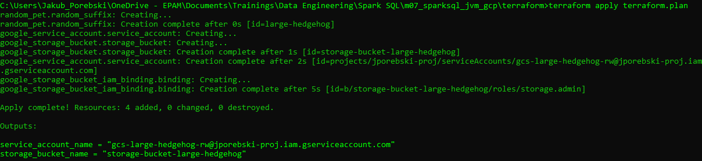
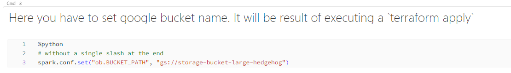
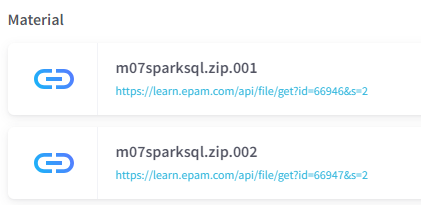
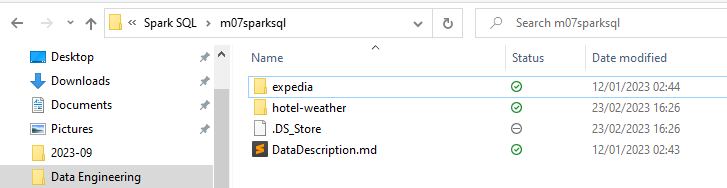
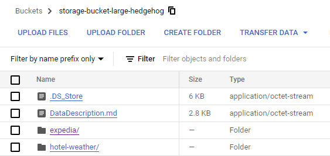
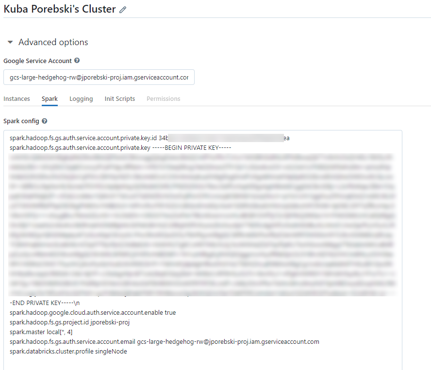

# Spark SQL Homework

## How to run in Databricks?
* Make sure you run terraform first:
```
cd terraform
terraform init
terraform plan -out terraform.plan
terraform apply terraform.plan
```
Results of the last command should display, among other things, a google cloud bucket name. This will be required to run the notebook.
Following image shows the result of the command. Note a key `storage_bucket_name`: 



* Clone this repo into your Databricks workspace.
* Main - and only one - notebook is located in `notebooks/Spark SQL Homework.sql` file.
* Put the name of the created bucket into a third cell, preserving a following format: `gs://<YOUR_BUCKET_NAME>`. 
This key is what should be put here in the notebook:



* Now, upload the data from the module homework page. These are data files which you should unpack:



As you can see, there are two folders inside the ZIP file, which look like this after unpacking:



You should upload folders one by one in a such way that each uploaded folder will be located in the root folder of the bucket:



I did it, but you can omit uploading files: `.DS_Store` and `DataDescription.md`.

## Cluster configuration

You have to provide your Google Cloud credentials into your cluster configuration. When editing cluster used for to run the notebook, set up values like those:
```
spark.hadoop.fs.gs.auth.service.account.private.key.id <PRIVATE_KEY_ID>
spark.hadoop.fs.gs.auth.service.account.private.key <PRIVATE_KEY_CONTENTS>
spark.hadoop.google.cloud.auth.service.account.enable true
spark.hadoop.fs.gs.project.id <GCP_PROJECT_ID>
spark.master local[*, 4]
spark.hadoop.fs.gs.auth.service.account.email <SERVICE_ACCOUNT_EMAIL>
spark.databricks.cluster.profile singleNode
```
Values to replace from a given template:

| Key                   | Value                               |
|-----------------------|-------------------------------------|
| PRIVATE_KEY_ID        | Id of service account key           |
| PRIVATE_KEY_CONTENTS  | Raw file contents of key            |
| GCP_PROJECT_ID        | That unique name/id of your project |
| SERVICE_ACCOUNT_EMAIL | Email of service account            | 

Example:



Save cluster configuration and restart it.

## Ready to go
* And you're ready to go! Open the notebook inside Databricks Workspace, and then run cell one by one.

