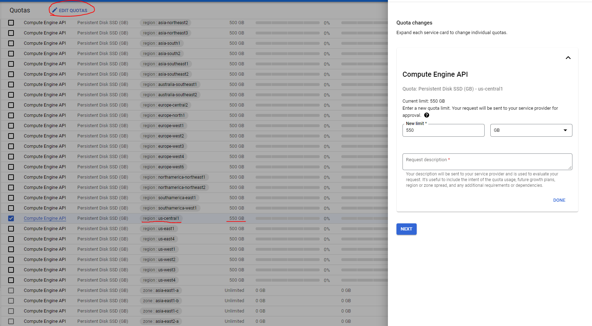

# M07_SparkSQL_JVM_GCP
1) Create your own project on GCP (currently Google offers trial accounts up to 300$).
2) You won't be able to create even smallest Databricks cluster because of Google Quotas. Go to IAM & Admin > Quotas. In filter search for "Persistent Disk SSD". Choose **specific region** for your future clusters, like "us-central1" and edit your quota to be higher than 500 (550 Gb should be enough for the smallest cluster). You'll need to give your phone number and description of the request, but usually such requests are approved automatically. 
     
   Note: You might have to apply Billing to your GCP account and input your payment information for this step.
3) On GCP in navigation menu go to Marketplace and search for Databricks. As of this moment, Databricks offers up to 14 day trial for new GCP accounts. Subscribe to the service.
4) After the subscription has been approved click on "Manage on provider" button on the Databricks marketplace page and sign in with your credentials.
5) Create Workspace in Databricks. Be sure to choose the region with increased quotas.
6) While your Workspace is loading, install Google Cloud CLI (gcloud & gsutil), Terraform and Databricks CLI.
7) Open your Workspace and give access to Databricks for your GCP project. 
8) On your Workspace page go to Settings > User Settings and generate a new application token.
9) Use `databricks configure --token` and provide link to your workspace as well as token to configure your Databricks CLI for your Workspace.
10) Use `gcloud auth login && gcloud auth application-default login && gcloud config set project [PROJECT]` to initialize access to your project.
11) Run `terraform init && terraform apply`. Provide your project ID and already **existing** bucket for Terraform state. Terraform will create additional bucket, service account with RW permissions for this bucket, as well as Databricks cluster.  
Note: You cluster will go offline in 2 hours of inactivity. Start it again from the cluster page if necessary.
12) Don't forget to `terraform destroy` your resources, deleting your Workspace and unsubscribing to Databricks after concluding all tutorials.